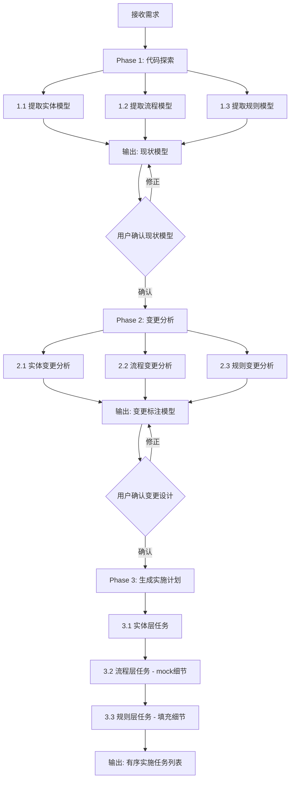

# reverse-modeling Skill 设计方案

## 一、核心方法论

关键洞察：软件开发不同于建筑，需求持续迭代导致"图纸"始终在变。面对新需求时，**还原当前图纸是第一要务**。通过现有代码反推出模型，再基于模型进行变更设计，而非直接在抽象语言上进行 VibeCoding。

### 模型三要素

1. **实体（Entity）** - 数据结构、类、对象及其关系（UML 类图表达）
2. **流程（Process）** - 调用链、交互序列、工作流（序列图表达，支持多层抽象）
3. **规则（Rule）** - 业务逻辑、校验、约束（伪代码 + 文字表达）

### 核心工作流

面对新需求，围绕三个问题展开：

- 实体关系是什么？有什么变更？
- 流程是什么？有什么变更？
- 规则是什么？有什么变更？

### 实施顺序

1. 先完成实体新增/变更
2. 再完成流程函数（细节用 mock，可立即测试）
3. 最后补充规则细节
4. 每步完成后 review + 验证，最小化熵

---

## 二、Skill 总体设计

### 名称：`reverse-modeling`

### 定位

面向**需求迭代**场景的结构化分析 Skill。当 AI Dev Agent 接到需求变更任务时，通过逆向建模方法将模糊的需求转化为精确的设计图纸，再基于图纸生成可执行的实施计划。

### 核心价值

- 将 VibeCoding 建立在"图纸"之上而非抽象语言之上
- 每一步都确定，完成一步、review 一步、验证一步
- 大幅减少返工和幻觉代码

### 目录结构

```
reverse-modeling/
├── SKILL.md                          # 主文件：流程指令与输出模板
├── references/
│   ├── entity-modeling-guide.md      # 实体建模详细指南与 Mermaid 语法
│   ├── process-modeling-guide.md     # 流程建模详细指南与序列图语法
│   └── rule-modeling-guide.md        # 规则建模详细指南与伪代码规范
└── examples/
    └── example-requirement.md        # 完整示例：一个需求迭代的建模全过程
```

---

## 三、输入输出定义

### 输入

| 项目               | 说明                                                     |
| ------------------ | -------------------------------------------------------- |
| 需求描述           | 用户提供的自然语言需求（可以是 PRD、口头描述、Issue 等） |
| 相关代码路径       | 与需求相关的代码文件/目录（Agent 自行探索或用户指定）    |
| 上下文信息（可选） | 已有的架构文档、数据库 schema、API 文档等                |

### 输出（按阶段递进）

**阶段 1 - 现状模型（As-Is Model）**

- 实体关系图（Mermaid classDiagram）
- 核心流程序列图（Mermaid sequenceDiagram）
- 关键规则清单（伪代码 + 文字）

**阶段 2 - 变更分析（Delta Analysis）**

- 实体变更标注（新增/修改/删除，用不同标记区分）
- 流程变更标注（新增步骤/修改步骤/删除步骤）
- 规则变更标注（新增规则/修改规则/删除规则）

**阶段 3 - 实施计划（Implementation Plan）**

- 有序的任务列表，按"实体 -> 流程(mock) -> 规则"顺序排列
- 每个任务包含：涉及文件、变更内容摘要、验证方法

---

## 四、执行流程



### 关键设计决策

- **三阶段递进，每阶段有确认点**：用户可以在每个阶段修正，避免后续返工
- **实施顺序固定为 实体->流程->规则**：这是文章验证过的最佳实践，每步可独立验证
- **流程阶段先 mock 细节**：这样可以提前测试整体流程，规则细节最后填充

---

## 五、SKILL.md 核心 Prompt 设计

SKILL.md 的核心内容将包含以下关键指令：

### 5.1 触发逻辑（写在 description 中）

```yaml
name: reverse-modeling
description: >-
  Structured methodology for software requirement development through reverse modeling. 
  Reverse-engineers existing code into a three-part model (Entities, Processes, Rules), 
  analyzes requirement changes against the model, and generates ordered implementation plans. 
  Use when: (1) developing new features on existing codebase, (2) iterating on requirements, 
  (3) user mentions requirement analysis/design/modeling, (4) need to understand existing 
  code structure before making changes, (5) user asks to analyze impact of a requirement change.
```

### 5.2 Phase 1 Prompt - 逆向建模（现状还原）

指导 Agent 执行：

- 读取相关代码，提取所有实体（类/接口/数据模型）及其关系
- 追踪核心业务流程的调用链，生成序列图
- 识别关键业务规则（校验、条件分支、计算逻辑），以伪代码表达
- 使用 Mermaid 格式输出实体图和流程图
- 使用"伪代码 + 说明"格式输出规则

### 5.3 Phase 2 Prompt - 变更分析

指导 Agent 执行：

- 对比需求描述与现状模型
- 标注实体变更（NEW/MODIFIED/DELETED）
- 标注流程变更（新增步骤用虚线、修改步骤用加粗等）
- 标注规则变更并写出变更后的伪代码
- 输出变更影响范围摘要

### 5.4 Phase 3 Prompt - 实施计划生成

指导 Agent 按固定顺序生成任务：

1. 实体层：新增/修改数据模型、数据库迁移
2. 流程层：新增/修改流程函数，细节全部 mock，编写可运行的流程测试
3. 规则层：逐个填充 mock 为真实规则逻辑，每个规则完成后验证

每个任务格式包含：任务描述、涉及文件、变更内容、验证方法。

---

## 六、模块拆分

该 Skill 采用**单 Skill + 参考文件渐进加载**的架构，不拆分为多个子 Skill，原因：

- 三个阶段是严格顺序执行的，不适合并行
- 用户可能只需要部分阶段（如只做现状分析）
- 通过 `references/` 目录实现渐进式披露，按需加载

### 各参考文件职责

- `**references/entity-modeling-guide.md`：详细的实体建模指导，包含 Mermaid classDiagram 语法、关系类型（继承/组合/聚合/关联）、变更标注约定、常见模式（Active Record、Repository 等）
- `**references/process-modeling-guide.md`：流程建模指导，包含 Mermaid sequenceDiagram 语法、多层抽象技巧（总体视图 vs 细节视图）、变更标注约定
- `**references/rule-modeling-guide.md`：规则建模指导，包含伪代码书写规范、规则分类（校验规则、计算规则、状态转换规则）、与流程/实体的关联方式
- `**examples/example-requirement.md`：一个完整的端到端示例，展示从需求文本到最终实施计划的全过程

---

## 七、实现要点

### SKILL.md 控制在 500 行以内

- 主文件包含：触发条件、三阶段工作流指令、输出模板
- 详细的建模语法和示例放入 `references/` 目录

### 输出格式选择 Mermaid

- Mermaid 格式对人和 AI 都友好
- 可在 IDE 中直接渲染预览
- 支持版本控制 diff

### 规则表达选择伪代码

- "最好的 Prompt 就是代码本身"
- 伪代码对人和 AI 都友好，比自然语言更精确
