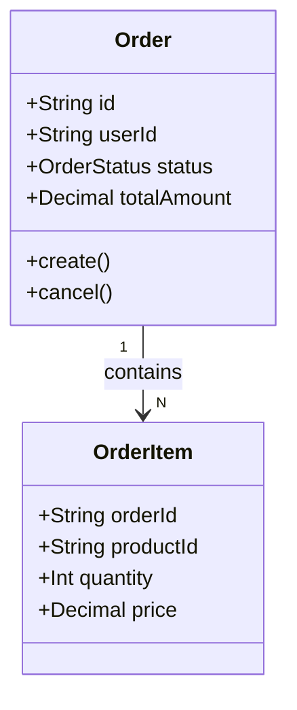
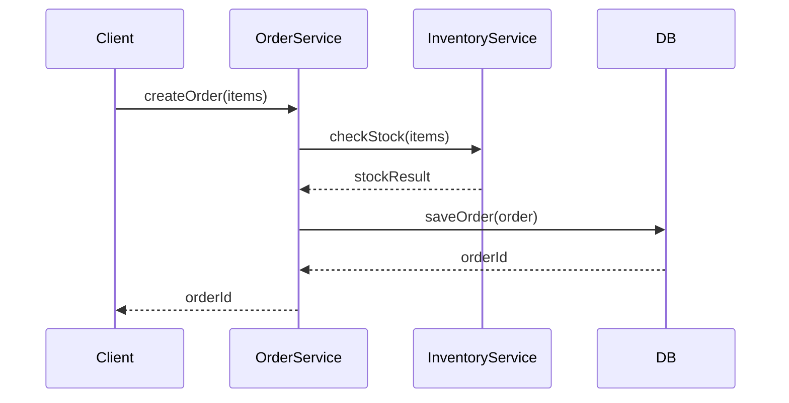
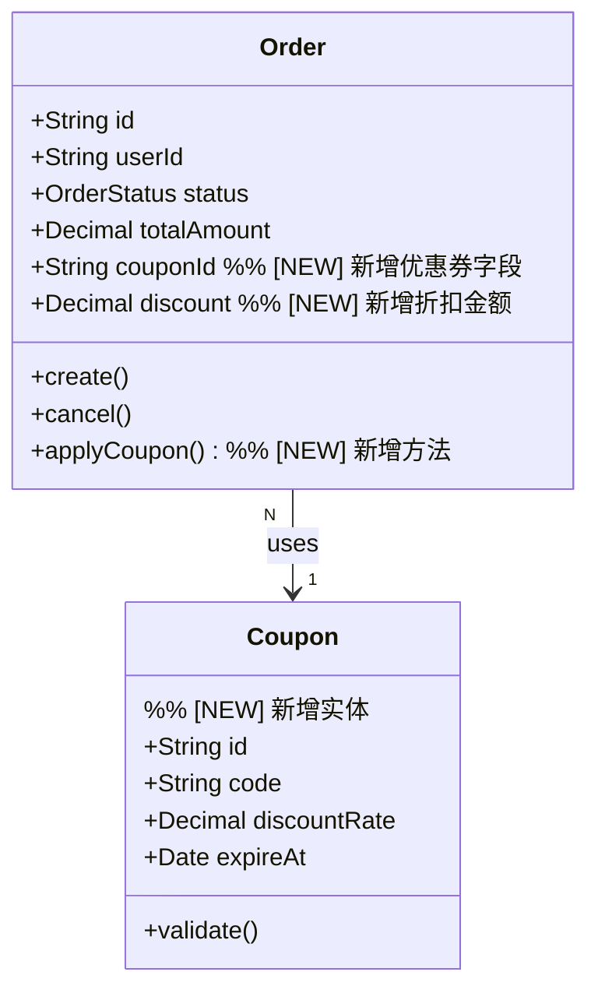

# 逆向建模 (Reverse Modeling)

将需求迭代建立在"图纸"之上，而非抽象语言之上。通过三阶段流程，从代码反推模型，再基于模型分析变更，最后生成确定性实施计划。

## 核心原则

- **先还原图纸，再谈变更**：不清楚现状就无法精确分析影响
- **三要素建模**：所有需求分析围绕 实体(Entity)、流程(Process)、规则(Rule) 展开
- **固定实施顺序**：实体 → 流程(mock) → 规则，每步完成后 review + 验证
- **显化表达**：用 Mermaid 图和伪代码代替自然语言，对人和 AI 都更精确

## 输入

| 输入项         | 说明                                            |
| -------------- | ----------------------------------------------- |
| 需求描述       | 自然语言需求（PRD、口头、Issue 均可）           |
| 相关代码路径   | 与需求相关的文件/目录（可自行探索或由用户指定） |
| 上下文（可选） | 已有架构文档、DB schema、API 文档等             |

---

## Phase 1：逆向建模 — 还原现状图纸

**目标**：从现有代码中提取三要素模型，输出 As-Is 图纸。

### 步骤

1. **探索代码**：读取需求相关的核心文件（Model/Entity/Service/Controller/Repository 等）
2. **提取实体**：识别所有数据结构、类、接口及其关系，生成类图
3. **提取流程**：追踪核心业务的调用链，生成序列图（先出总体视图，再按需下钻细节）
4. **提取规则**：识别校验逻辑、条件分支、计算公式、状态转换，用伪代码表达

### 实体输出格式



> 详细语法见 [references/entity-modeling-guide.md](references/entity-modeling-guide.md)

### 流程输出格式



> 详细语法见 [references/process-modeling-guide.md](references/process-modeling-guide.md)

### 规则输出格式

```
规则 R1：库存校验规则
触发时机：创建订单前
伪代码：
  FOR EACH item IN order.items:
    stock = inventory.getStock(item.productId)
    IF stock < item.quantity:
      THROW InsufficientStockError(item.productId)
说明：逐商品校验，任一不足则整单拒绝
```

> 详细语法见 [references/rule-modeling-guide.md](references/rule-modeling-guide.md)

### Phase 1 输出清单

- [ ] 实体关系图（classDiagram）
- [ ] 核心流程序列图（sequenceDiagram）
- [ ] 关键规则清单（伪代码 + 说明）

**完成后暂停，等待用户确认现状模型是否准确，再进入 Phase 2。**

---

## Phase 2：变更分析 — Delta Analysis

**目标**：对比需求与现状模型，标注三要素的变更，输出 To-Be 图纸。

### 步骤

1. **解读需求**：将需求描述拆解为对实体/流程/规则的具体变更意图
2. **标注实体变更**：在类图上标注 `[NEW]` / `[MODIFIED]` / `[DELETED]`
3. **标注流程变更**：在序列图上标注新增步骤（用 `Note` 标识）、修改步骤
4. **标注规则变更**：列出变更规则，写出变更前后的伪代码对比
5. **输出影响摘要**：列出受影响的文件、接口、数据表

### 变更标注示例

**实体变更**：



**规则变更**：

```
规则 R3：优惠券校验规则 [NEW]
触发时机：创建订单，且 couponId 不为空时
伪代码：
  coupon = couponRepo.findById(order.couponId)
  IF coupon IS NULL: THROW CouponNotFoundError
  IF coupon.expireAt < NOW(): THROW CouponExpiredError
  IF coupon.userId != order.userId: THROW CouponOwnershipError
  order.discount = order.totalAmount * coupon.discountRate
  order.totalAmount = order.totalAmount - order.discount
```

### Phase 2 输出清单

- [ ] 带变更标注的实体图
- [ ] 带变更标注的流程图
- [ ] 规则变更对比（before/after 伪代码）
- [ ] 影响范围摘要（受影响文件/表/接口列表）

**完成后暂停，等待用户确认变更设计，再进入 Phase 3。**

---

## Phase 3：生成实施计划

**目标**：将变更设计转化为有序、可执行的任务列表。

### 固定实施顺序

```
Step 1: 实体层（Entity Layer）
  → 新增/修改数据模型、数据库迁移脚本

Step 2: 流程层（Process Layer）— mock 细节
  → 新增/修改流程函数，业务规则全部用 TODO/mock 替代
  → 此时整体流程可运行，可编写流程集成测试

Step 3: 规则层（Rule Layer）— 填充细节
  → 逐个将 mock 替换为真实规则实现
  → 每个规则完成后立即运行对应单元测试
```

> 原则：每完成一步，立即 review + 验证，再开始下一步，使整体熵最小化。

### 任务卡片格式

```
Task 1.1：新增 Coupon 实体
层级：实体层
涉及文件：
  - src/models/Coupon.ts（新建）
  - src/migrations/20260315_add_coupon.sql（新建）
  - src/models/Order.ts（修改：新增 couponId, discount 字段）
变更内容：
  - 创建 Coupon 数据模型（id, code, discountRate, expireAt, userId）
  - Order 表新增 coupon_id, discount 两列（均可为空）
验证方法：
  - 运行数据库迁移，确认表结构正确
  - 确认 ORM 映射无报错

Task 2.1：修改 createOrder 流程（mock 规则）
层级：流程层
涉及文件：
  - src/services/OrderService.ts（修改）
变更内容：
  - createOrder 方法新增 couponId 参数
  - 调用 couponService.validate(couponId) — TODO mock，直接返回 true
  - 调用 couponService.applyDiscount(order, coupon) — TODO mock，discount = 0
验证方法：
  - 运行 createOrder 集成测试（携带和不携带 couponId 均应通过）

Task 3.1：实现优惠券校验规则 R3
层级：规则层
涉及文件：
  - src/services/CouponService.ts（新建）
变更内容：
  - 实现 validate(couponId, userId) 方法（按规则 R3 伪代码）
  - 替换 OrderService 中对应的 TODO mock
验证方法：
  - 运行 CouponService 单元测试（覆盖：券不存在、已过期、非本人券、正常场景）
```

### Phase 3 输出清单

- [ ] 实体层任务卡片（含迁移脚本）
- [ ] 流程层任务卡片（含 mock 策略）
- [ ] 规则层任务卡片（含验证用例）

---

## 参考资料

- 实体建模语法与模式：[references/entity-modeling-guide.md](references/entity-modeling-guide.md)
- 流程建模语法与多层抽象：[references/process-modeling-guide.md](references/process-modeling-guide.md)
- 规则伪代码规范与分类：[references/rule-modeling-guide.md](references/rule-modeling-guide.md)
- 完整端到端示例：[examples/example-requirement.md](examples/example-requirement.md)
