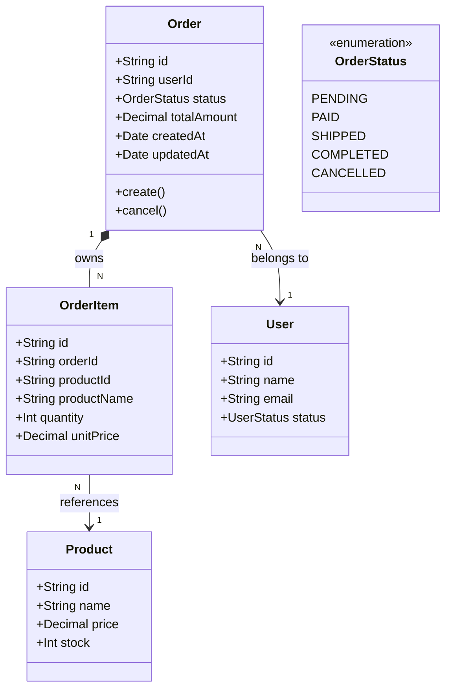
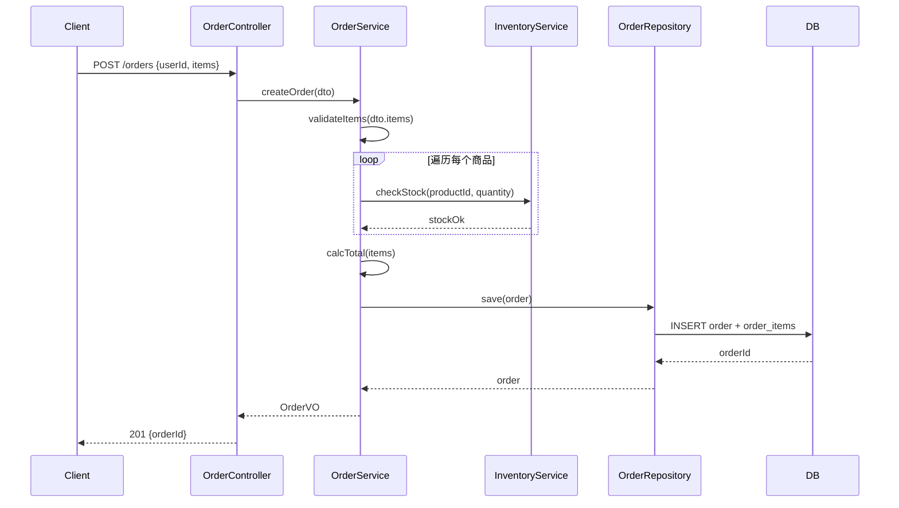
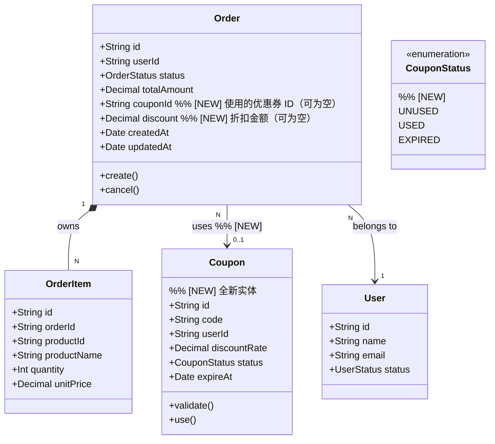
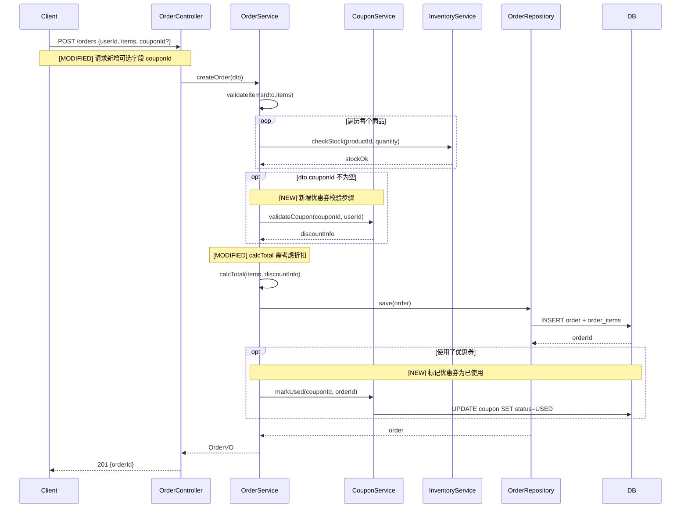

# 端到端示例：电商订单添加优惠券功能

本示例展示从需求文本到最终实施计划的完整逆向建模过程。

---

## 输入：需求描述

> **需求**：在用户下单时支持使用优惠券。用户可以在创建订单时输入一张优惠券码，
> 系统校验优惠券的有效性（包括是否过期、是否属于当前用户），
> 校验通过后按照优惠券的折扣比例计算折扣金额，并在订单总价中扣除。
> 一张订单只能使用一张优惠券，优惠券使用后不可重复使用。

**相关代码路径**：`src/orders/`、`src/users/`

---

## Phase 1：逆向建模 — 现状图纸

### 1.1 实体模型（As-Is）



### 1.2 创建订单流程（As-Is）



### 1.3 规则清单（As-Is）

```
规则 V1：商品库存校验
类型：校验规则
触发时机：创建订单前，遍历每个商品
关联实体：Product（stock 字段）
关联流程：createOrder 序列图 Step 3（checkStock 调用）
伪代码：
  FOR EACH item IN dto.items DO
    stock = inventoryService.getStock(item.productId)
    IF stock < item.quantity:
      THROW InsufficientStockError(item.productId, stock, item.quantity)
  END FOR

规则 C1：订单总价计算
类型：计算规则
触发时机：库存校验通过后，保存订单前
关联实体：Order（totalAmount）、OrderItem（quantity, unitPrice）
关联流程：createOrder 序列图 Step 4（calcTotal 调用）
伪代码：
  total = 0
  FOR EACH item IN order.items DO
    total = total + item.quantity * item.unitPrice
  END FOR
  order.totalAmount = total
```

**[用户确认现状图纸准确后，进入 Phase 2]**

---

## Phase 2：变更分析 — Delta Analysis

### 2.1 实体变更



### 2.2 流程变更



### 2.3 规则变更

```
规则 C1：订单总价计算  [MODIFIED]
变更原因：需扣除优惠券折扣

变更前：
  total = SUM(item.quantity * item.unitPrice FOR item IN order.items)
  order.totalAmount = total

变更后：
  total = SUM(item.quantity * item.unitPrice FOR item IN order.items)
  IF order.couponId IS NOT NULL:
    coupon = couponRepo.findById(order.couponId)
    discount = total * coupon.discountRate
    total = total - discount
    order.discount = discount
  order.totalAmount = total

---

规则 V2：优惠券校验规则  [NEW]
类型：校验规则
触发时机：创建订单，且 dto.couponId 不为空时
关联实体：Coupon（status, expireAt, userId, discountRate）
关联流程：createOrder 序列图，opt 代码块（validateCoupon 调用）
伪代码：
  coupon = couponRepo.findByCode(couponCode)
  IF coupon IS NULL:
    THROW BusinessError(COUPON_NOT_FOUND, couponCode)
  IF coupon.userId != order.userId:
    THROW BusinessError(COUPON_NOT_OWNED, couponCode)
  IF coupon.status == USED:
    THROW BusinessError(COUPON_ALREADY_USED, couponCode)
  IF coupon.expireAt < NOW():
    THROW BusinessError(COUPON_EXPIRED, couponCode)
  RETURN DiscountInfo(coupon.id, coupon.discountRate)

---

规则 I1：优惠券使用幂等规则  [NEW]
类型：幂等规则
触发时机：markUsed 调用时
关联实体：Coupon（status）
关联流程：createOrder 序列图，opt 代码块（markUsed 调用）
伪代码：
  coupon = couponRepo.findById(couponId)
  IF coupon.status == USED AND coupon.usedOrderId == orderId:
    RETURN  // 同一订单重复调用，幂等忽略
  IF coupon.status == USED AND coupon.usedOrderId != orderId:
    THROW BusinessError(COUPON_CONFLICT, couponId)
  coupon.status = USED
  coupon.usedOrderId = orderId
  coupon.usedAt = NOW()
  couponRepo.save(coupon)
```

### 2.4 影响范围摘要

| 类型       | 受影响项                                                                                                                                    |
| ---------- | ------------------------------------------------------------------------------------------------------------------------------------------- |
| 新增文件   | `src/coupons/Coupon.entity.ts`、`src/coupons/CouponService.ts`、`src/coupons/CouponRepository.ts`、`src/migrations/add_coupon_table.sql`    |
| 修改文件   | `src/orders/Order.entity.ts`、`src/orders/OrderService.ts`、`src/orders/dto/CreateOrderDto.ts`、`src/migrations/alter_order_add_coupon.sql` |
| 修改接口   | `POST /orders` 新增可选参数 `couponId`                                                                                                      |
| 修改数据表 | `orders` 表新增 `coupon_id`、`discount` 列；新增 `coupons` 表                                                                               |

**[用户确认变更设计后，进入 Phase 3]**

---

## Phase 3：实施计划

### Step 1：实体层

---

**Task 1.1：新增 Coupon 实体与数据表**

层级：实体层
涉及文件：

- `src/coupons/Coupon.entity.ts`（新建）
- `src/migrations/20260315_create_coupon.sql`（新建）

变更内容：

- 创建 `Coupon` 数据模型（id, code, userId, discountRate, status, expireAt, usedOrderId, usedAt）
- 创建 `coupons` 表，建立 `code` 唯一索引、`userId` 索引

验证方法：

- 运行迁移脚本，确认 `coupons` 表结构
- 确认 ORM 映射无报错，基本 CRUD 可用

---

**Task 1.2：修改 Order 实体，新增优惠券相关字段**

层级：实体层
涉及文件：

- `src/orders/Order.entity.ts`（修改）
- `src/migrations/20260315_alter_order_add_coupon.sql`（新建）

变更内容：

- `Order` 实体新增 `couponId?: string`、`discount?: Decimal` 字段（均可为空）
- `orders` 表新增 `coupon_id VARCHAR`、`discount DECIMAL` 两列

验证方法：

- 运行迁移脚本，确认字段新增成功
- 确认不带优惠券的现有测试仍正常通过（字段可为空，不影响存量逻辑）

---

### Step 2：流程层（mock 规则细节）

---

**Task 2.1：新建 CouponService，提供 mock 实现**

层级：流程层
涉及文件：

- `src/coupons/CouponService.ts`（新建）
- `src/coupons/CouponRepository.ts`（新建）

变更内容：

```typescript
// CouponService - mock 实现，规则细节后续填充
class CouponService {
  validateCoupon(couponCode: string, userId: string): DiscountInfo {
    // TODO [Rule V2]: 优惠券校验规则
    return { couponId: "mock-id", discountRate: 0 }; // mock 返回
  }

  markUsed(couponId: string, orderId: string): void {
    // TODO [Rule I1]: 优惠券幂等标记规则
  }
}
```

验证方法：

- 确认 CouponService 可被注入，接口签名正确

---

**Task 2.2：修改 OrderService.createOrder 流程，接入 CouponService**

层级：流程层
涉及文件：

- `src/orders/OrderService.ts`（修改）
- `src/orders/dto/CreateOrderDto.ts`（修改，新增 `couponId?: string`）

变更内容（伪代码骨架）：

```typescript
async createOrder(dto: CreateOrderDto) {
  // 原有：校验库存
  await this.validateStock(dto.items);

  // [NEW] 优惠券校验（mock）
  let discountInfo = null;
  if (dto.couponId) {
    discountInfo = await this.couponService.validateCoupon(dto.couponId, dto.userId);
  }

  // [MODIFIED] 计算总价（传入 discountInfo，内部仍 mock discount 逻辑）
  const order = this.buildOrder(dto, discountInfo);

  await this.orderRepository.save(order);

  // [NEW] 标记优惠券已使用（mock）
  if (dto.couponId) {
    await this.couponService.markUsed(discountInfo.couponId, order.id);
  }

  return order;
}
```

验证方法：

- 运行 `createOrder` 集成测试（不带 couponId，确认原有流程不受影响）
- 运行 `createOrder` 集成测试（带 couponId，确认新流程骨架可执行，mock 返回 discount=0）

---

### Step 3：规则层（填充真实逻辑）

---

**Task 3.1：实现规则 V2 — 优惠券校验**

层级：规则层
涉及文件：

- `src/coupons/CouponService.ts`（修改，替换 validateCoupon 的 TODO）

变更内容：按规则 V2 伪代码实现真实校验逻辑（见 Phase 2 规则变更）

验证方法（单元测试，覆盖以下场景）：

- [ ] 优惠券码不存在 → 抛出 `COUPON_NOT_FOUND`
- [ ] 优惠券不属于当前用户 → 抛出 `COUPON_NOT_OWNED`
- [ ] 优惠券已被使用 → 抛出 `COUPON_ALREADY_USED`
- [ ] 优惠券已过期 → 抛出 `COUPON_EXPIRED`
- [ ] 合法优惠券 → 返回正确 `DiscountInfo`

---

**Task 3.2：实现规则 C1 变更 — 含折扣的总价计算**

层级：规则层
涉及文件：

- `src/orders/OrderService.ts`（修改，更新 buildOrder 中的 calcTotal 逻辑）

变更内容：按规则 C1 变更后伪代码，将折扣纳入总价计算

验证方法（单元测试）：

- [ ] 无优惠券：total = items 金额之和
- [ ] 有优惠券（discountRate=0.1）：total = items 之和 _ 0.9，discount = items 之和 _ 0.1
- [ ] 折扣后金额精度正确（使用 Decimal 运算，避免浮点误差）

---

**Task 3.3：实现规则 I1 — 优惠券幂等标记**

层级：规则层
涉及文件：

- `src/coupons/CouponService.ts`（修改，替换 markUsed 的 TODO）

变更内容：按规则 I1 伪代码实现 markUsed，处理并发重复调用

验证方法（单元测试）：

- [ ] 首次标记：coupon.status 变为 USED，记录 usedOrderId
- [ ] 同一订单重复调用：幂等忽略，不抛异常
- [ ] 不同订单争抢：抛出 `COUPON_CONFLICT`

---

**全部任务完成后，运行完整回归测试：**

- [ ] 原有下单流程（无优惠券）全部测试通过
- [ ] 含优惠券下单流程 E2E 测试通过
- [ ] 优惠券并发场景压测（同一券并发下单，只有一个订单成功）
