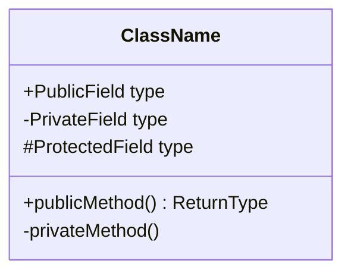
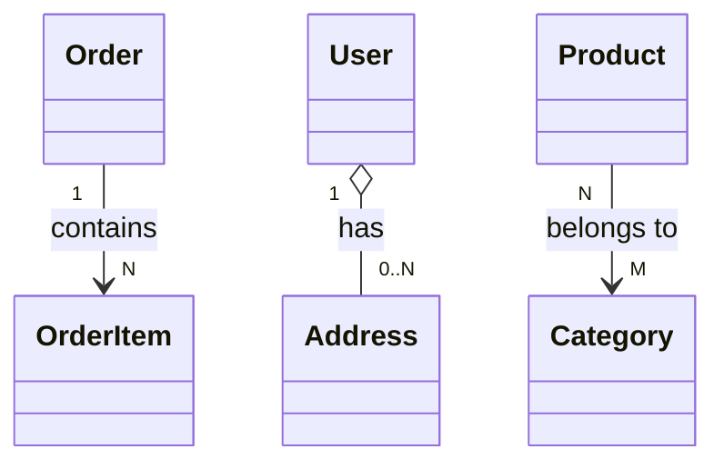
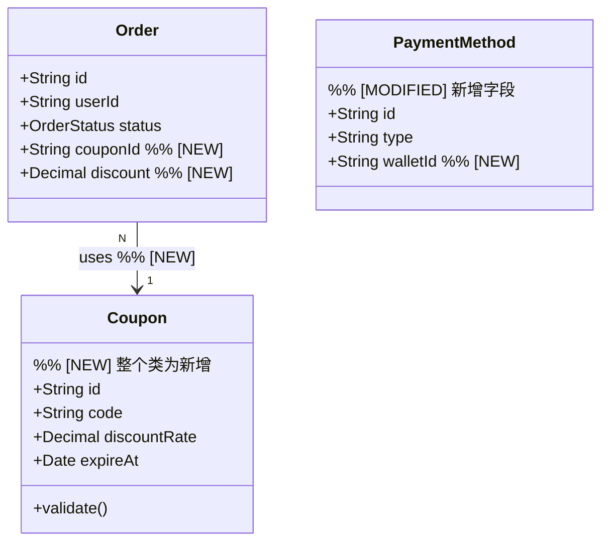
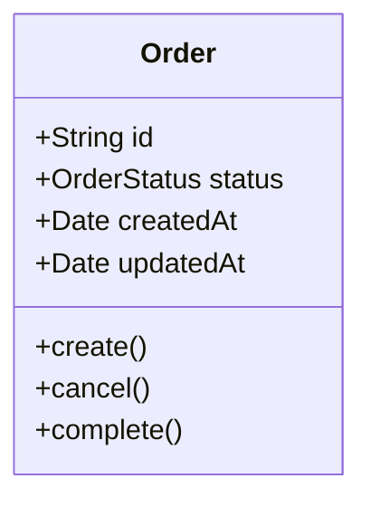
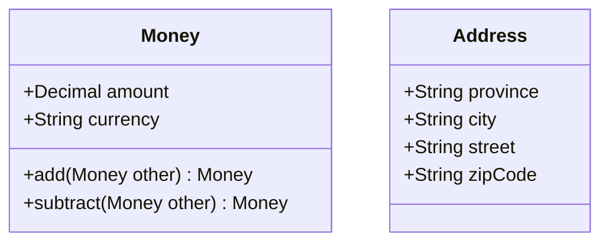
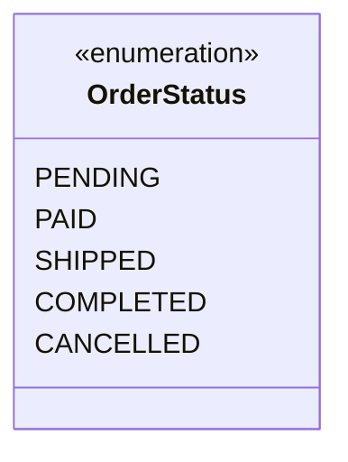
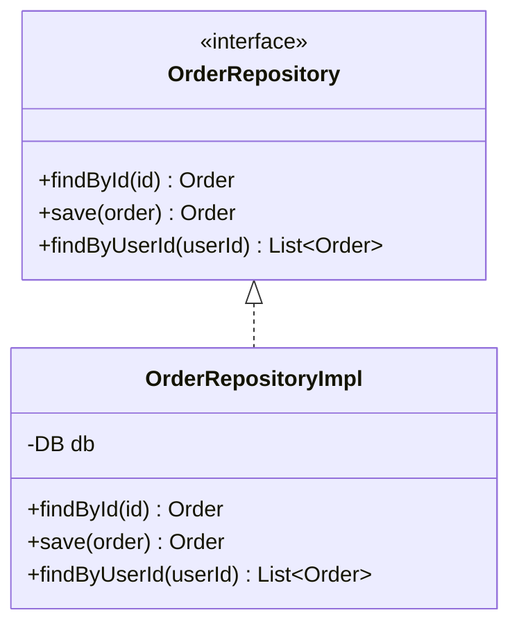
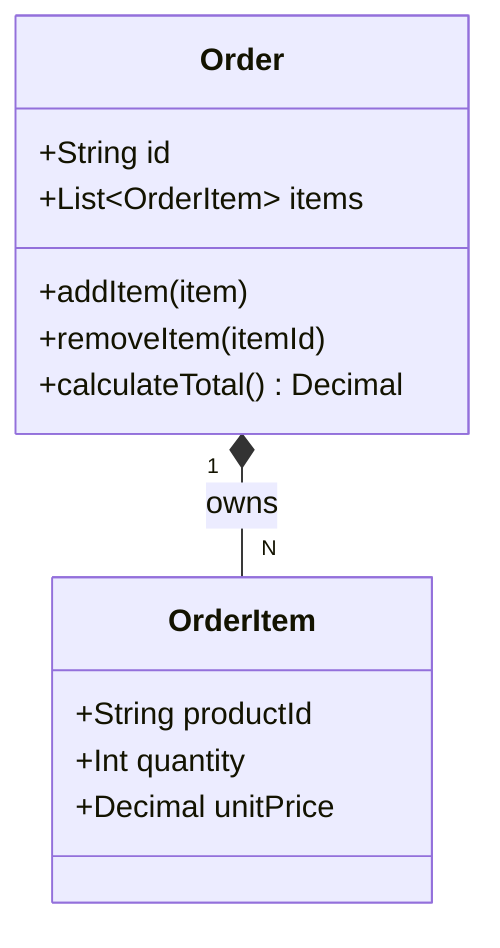

# 实体建模指南

## 目录

1. [基本语法](#1-基本语法)
2. [关系类型](#2-关系类型)
3. [变更标注约定](#3-变更标注约定)
4. [常见建模模式](#4-常见建模模式)
5. [从代码提取实体的技巧](#5-从代码提取实体的技巧)

---

## 1 基本语法

使用 Mermaid `classDiagram`：

**字段可见性符号**：

- `+` 公有
- `-` 私有
- `#` 受保护
- `~` 包级别

**常用类型简写**：`String`, `Int`, `Decimal`, `Boolean`, `Date`, `List`, `Map`

---

## 2 关系类型

| 关系 | Mermaid 语法 | 含义                     |
| ---- | ------------ | ------------------------ | ------------ |
| 关联 | `A --> B`    | A 持有 B 的引用          |
| 依赖 | `A ..> B`    | A 使用 B（临时）         |
| 聚合 | `A o-- B`    | A 包含 B，B 可独立存在   |
| 组合 | `A *-- B`    | A 包含 B，B 不可独立存在 |
| 继承 | `A <         | -- B`                    | B 继承 A     |
| 实现 | `A <         | .. B`                    | B 实现接口 A |

**基数标注**：

---

## 3 变更标注约定

在注释中使用标签标注变更类型：

| 标签            | 含义                                 | 使用位置           |
| --------------- | ------------------------------------ | ------------------ |
| `%% [NEW]`      | 新增的类或字段                       | 类定义前或字段行尾 |
| `%% [MODIFIED]` | 修改的类或字段                       | 类定义前或字段行尾 |
| `%% [DELETED]`  | 删除的类或字段（保留显示以说明影响） | 类定义前或字段行尾 |

**示例**：

---

## 4 常见建模模式

### 4.1 领域实体（Domain Entity）

有唯一标识、有生命周期：

### 4.2 值对象（Value Object）

无唯一标识、不可变：

### 4.3 枚举状态

### 4.4 Repository 模式

### 4.5 聚合根（Aggregate Root）

---

## 5 从代码提取实体的技巧

### 5.1 识别入口

优先扫描以下文件/目录（按语言/框架调整）：

| 语言/框架         | 实体位置                                     |
| ----------------- | -------------------------------------------- |
| Java/Spring       | `@Entity` 注解类、`domain/` 包               |
| TypeScript/NestJS | `*.entity.ts`、`*.model.ts`、`*.dto.ts`      |
| Python/Django     | `models.py`、继承 `Model` 的类               |
| Go                | `struct` 定义（在 `model/`、`entity/` 目录） |
| Ruby/Rails        | `app/models/` 目录                           |

### 5.2 提取关系

- 字段类型为另一个实体 → **关联**
- `belongsTo` / `hasMany` / `hasOne` 注解 → **关联 + 基数**
- 嵌套结构体/内部类 → **组合**
- 接口实现 → **实现关系**

### 5.3 控制图的粒度

- **第一遍**：只画核心实体（5~10 个），忽略工具类
- **按需细化**：当某个实体的内部结构对分析有影响时，再补充其字段
- **避免过载**：超过 15 个节点时，拆分为多张子图（按领域/模块划分）
