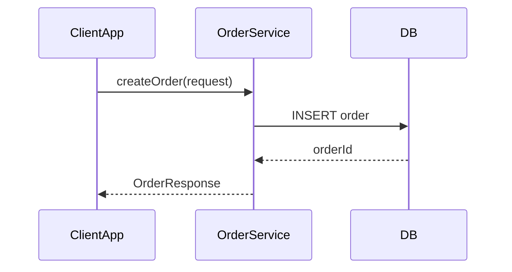
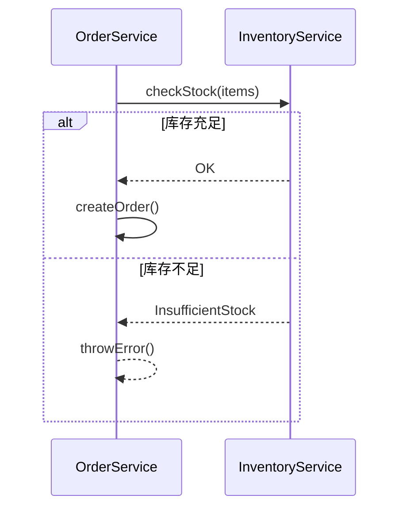
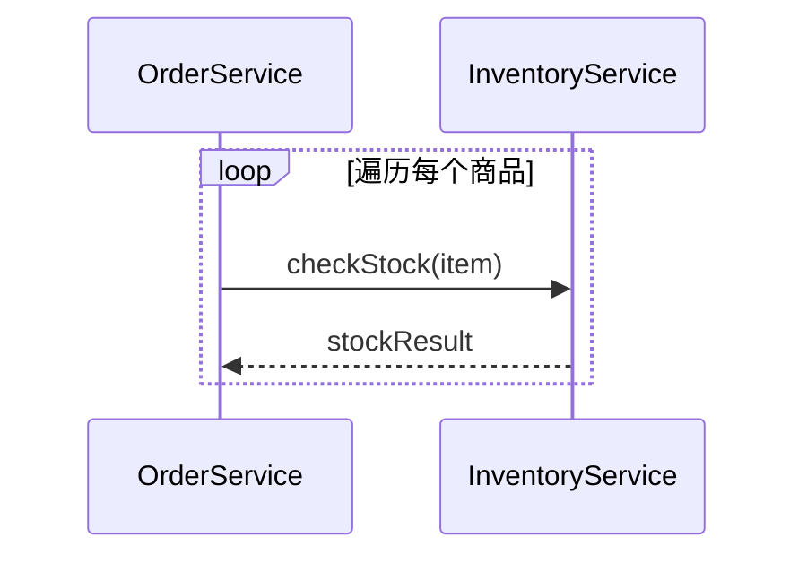
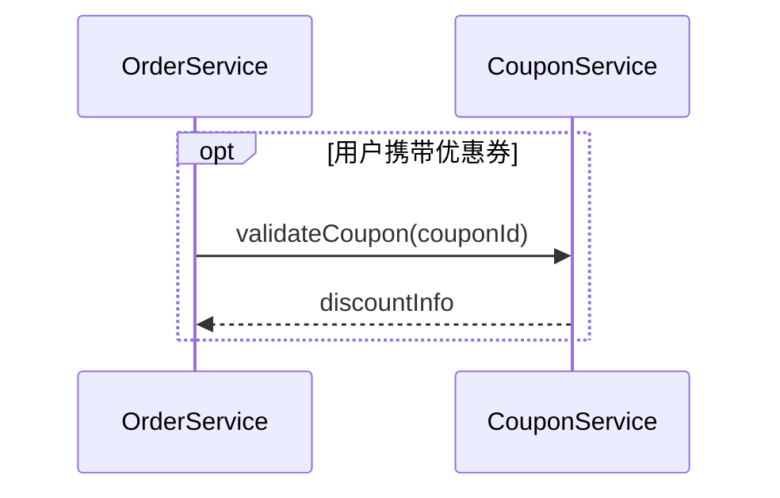
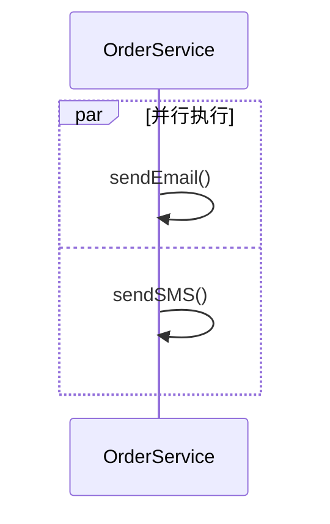
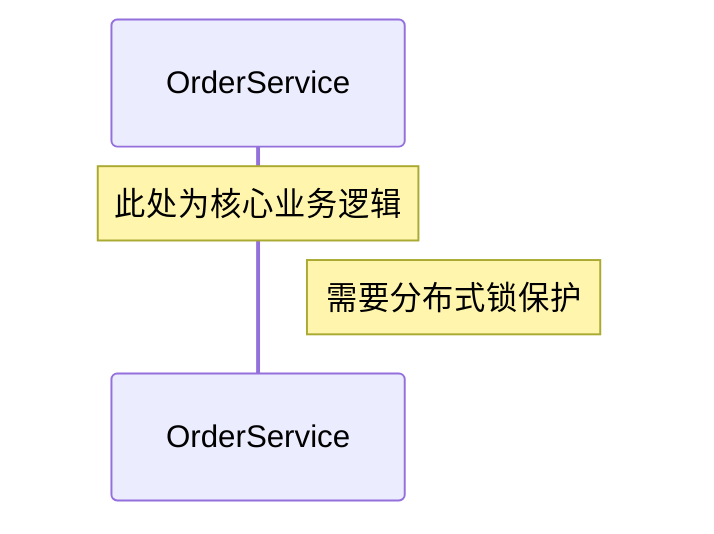
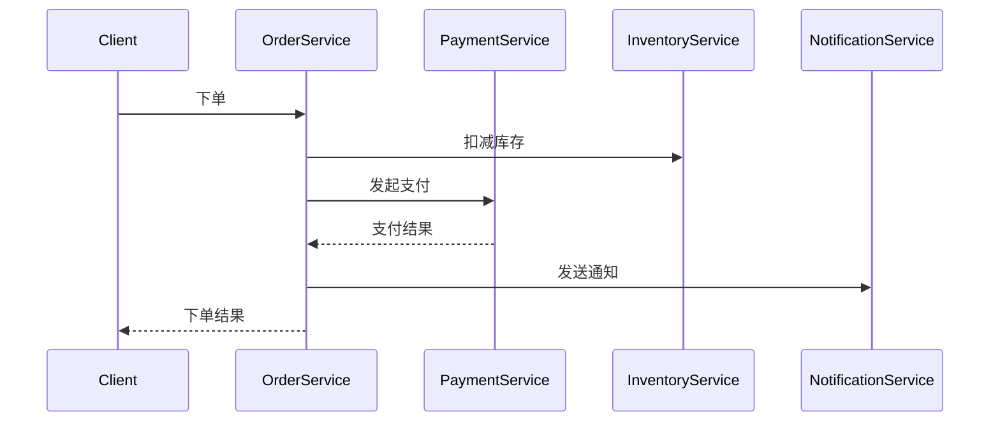
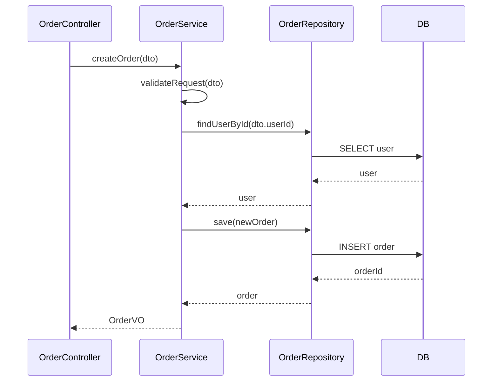
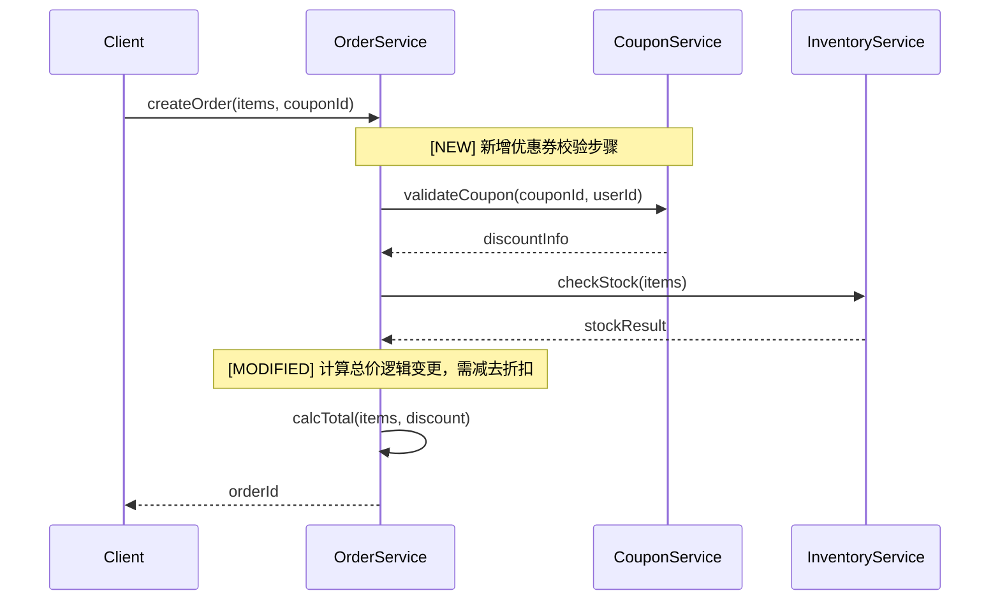

# 流程建模指南

## 目录

1. [基本语法](#1-基本语法)
2. [消息类型](#2-消息类型)
3. [控制结构](#3-控制结构)
4. [多层抽象策略](#4-多层抽象策略)
5. [变更标注约定](#5-变更标注约定)
6. [从代码提取流程的技巧](#6-从代码提取流程的技巧)

---

## 1 基本语法

使用 Mermaid `sequenceDiagram`：

**参与者声明**：

- `participant Name` — 普通参与者（矩形框）
- `actor Name` — 人类用户（小人图标）
- `participant Name as Alias` — 起别名简化显示

---

## 2 消息类型

| 语法          | 样式         | 含义      |
| ------------- | ------------ | --------- |
| `A->>B: msg`  | 实线实心箭头 | 同步调用  |
| `A-->>B: msg` | 虚线实心箭头 | 返回/响应 |
| `A-)B: msg`   | 实线开放箭头 | 异步消息  |
| `A-xB: msg`   | 实线 X 结尾  | 失败/错误 |
| `A--xB: msg`  | 虚线 X 结尾  | 异步失败  |

---

## 3 控制结构

### 条件分支

### 循环

### 可选步骤

### 并行

### 注释说明

---

## 4 多层抽象策略

逆向建模中，流程图应支持"放大/缩小"视角：

### 第一层：总体视图（L1）

只展示服务间的核心交互，忽略内部实现细节。用于**把握整体流程**。

### 第二层：服务内视图（L2）

展示单个服务内部的方法调用链。用于**分析变更影响**。

### 第三层：规则内视图（L3）

展示单个业务规则的执行逻辑。用于**确认规则实现细节**。通常用伪代码补充，而非再画序列图。

**建议**：

- Phase 1（现状还原）先出 L1，需要时补 L2
- Phase 2（变更分析）在 L2 上标注变更
- Phase 3（实施计划）参考 L2/L3 拆分任务

---

## 5 变更标注约定

在 `Note` 中标注变更，或在消息文字中加前缀：

| 前缀         | 含义                                 |
| ------------ | ------------------------------------ |
| `[NEW]`      | 新增的步骤或参与者                   |
| `[MODIFIED]` | 修改的步骤                           |
| `[DELETED]`  | 删除的步骤（用删除线文字或注释说明） |

**示例**：

---

## 6 从代码提取流程的技巧

### 6.1 识别入口

从以下位置开始追踪调用链：

- **HTTP 入口**：Controller / Handler / Router
- **消息队列入口**：Consumer / Listener / Subscriber
- **定时任务入口**：Scheduler / Cron / Job
- **事件入口**：EventHandler / DomainEventListener

### 6.2 追踪调用链

1. 找到入口方法
2. 记录每一个外部调用（跨类/跨服务/跨进程）
3. 标注调用方向和数据传递
4. 记录异常分支（`catch` 块中的逻辑）

### 6.3 识别异步边界

- 消息队列发布（MQ publish）→ 用 `-)` 异步箭头
- 事件发布（Event dispatch）→ 标注为异步
- 回调/Promise/Future → 展示为两段序列图（发布 + 订阅）

### 6.4 控制图的粒度

- **不要**把每一行代码都画进去（会淹没关键信息）
- **应该**以"是否跨越系统/服务/模块边界"作为是否画节点的判断标准
- 纯内存操作（如字段赋值、格式转换）不需要出现在序列图中
